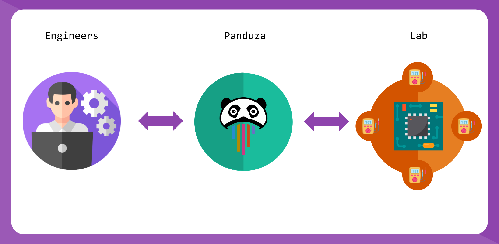
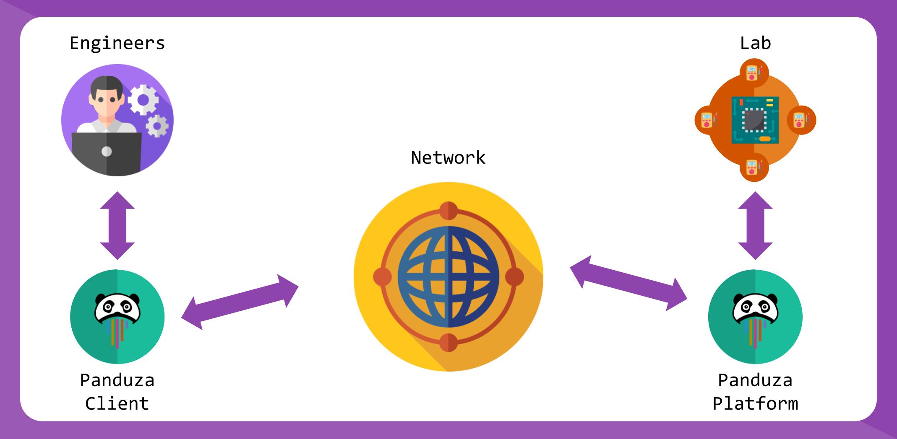
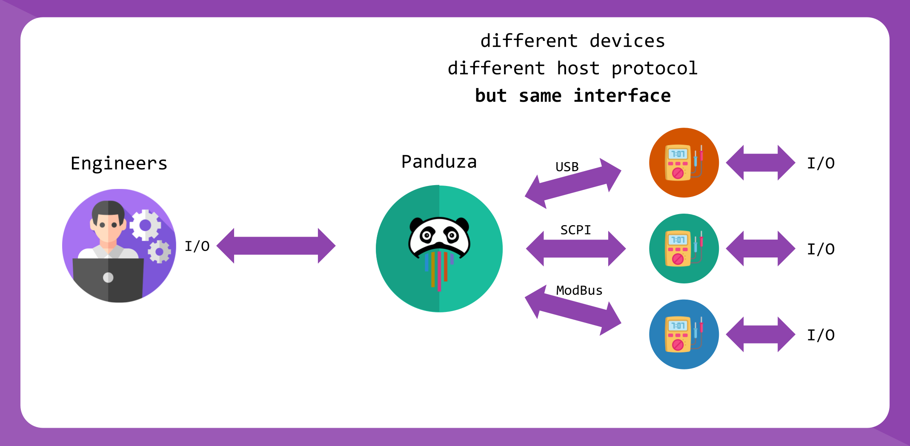
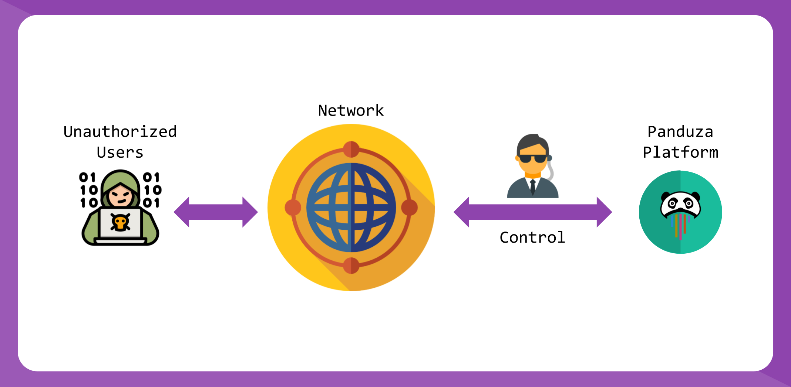

# Panduza

Panduza is a software ecosystem for embedded engineers to remotely control their electronic laboratory.

It is an **open-source** and **collaborative** project.



## They talk about us !

- [ADVANS LAB](https://www.elsys-design.com/fr/panduza-pour-un-labo-connecte-2-0/)


## Goals

Panduza aims to :

### Allow remote control of any electronic equipment through a network.



**Problems solved**

- Embedded engineers are too often forced to work constantly in their lab (close to the physical boards)
- Managers need to share hardware between embedded engineers in different location
- Embedded engineers need to collaborate with other teams or coworkers
- Embedded engineers want to work on their project from anywhere in the world
- Monitoring made easy with video streaming and graphic representation of the equipment


### Standardize device interfaces

Panduza provides a universal API to standardize access to devices.



**Problems Solved**

- Two power supplies may have the same features but very different ways to be addressed. With Panduza, all the devices from a same family will be accessible via universal interfaces
- Engineers save time and avoid reinventing the wheel every time a new equipment must be used

### Improve Test Bench Creation

Panduza provides support for testers.


**Problems Solved**

- Engineers can benefit from a flexible system that interfaces with the most common test frameworks on the market
- Through very user-friendly Python and C++ APIs, test creation doesn't require highly skilled programmers and bulky code
- Test benches are easily reusable from one project to another
- Test creation and monitoring made possible with intuitive graphic applications where no coding is required

### Ensure cyber security

Panduza provides tools to ensure security



**Situations Solved**

- engineers that set network connection on its lab with no cyber security knowledge

### Manual installation

Create the directory /etc/panduza on your server

```bash
sudo mkdir -p /etc/panduza
```

Create the file for docker-compose

```bash
sudo touch /etc/panduza
```

fill it with the given content

```yml
  # docker compose run --service-ports mosquitto
  mosquitto:
    image: eclipse-mosquitto
    ports:
      - 1883:1883
      - 9001:9001
    volumes:
      - ./data/mosquitto.conf:/mosquitto/config/mosquitto.conf


  panduza-py-platform:
    # image: ghcr.io/panduza/panduza-py-platform:latest
    # To use your local platform build
    image: local/panduza-py-platform
    privileged: true
    depends_on:
      - mosquitto
    network_mode: host
    volumes:
      - .:/etc/panduza
      - /run/udev:/run/udev:ro
    # command: bash

```

Create a tree.json

```json
{
    "machine": "my_lab_server",
    "brokers": {
        "test_broker": {
            "addr": "localhost",
            "port": 1883,
            "interfaces": [
                {
                    "name": "My_Input_Output",
                    "driver": "pza_modbus_dio",
                    "settings":{
                        "port":"/dev/ttyACM0"
                    }
                }
            ]
        }
    }
}

```

Test the DIO. Make sure Mosquitto service is inactive

```bash
service mosquitto stop
service mosquitto status

```
Build image

```bash
docker build --no-cache --tag local/panduza-py-platform:latest . 

```
Run docker compose

```bash
docker compose up
```
