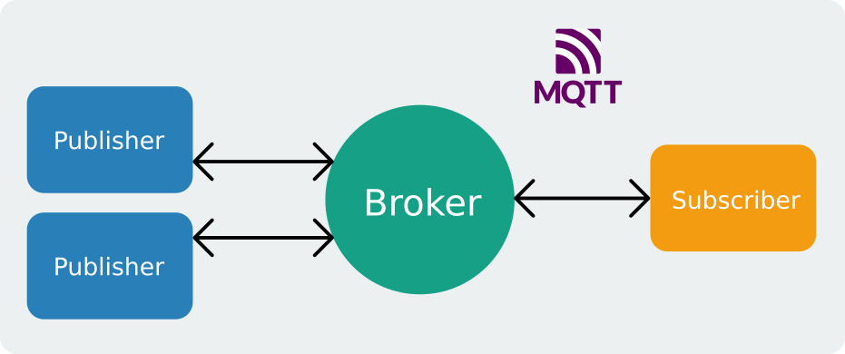
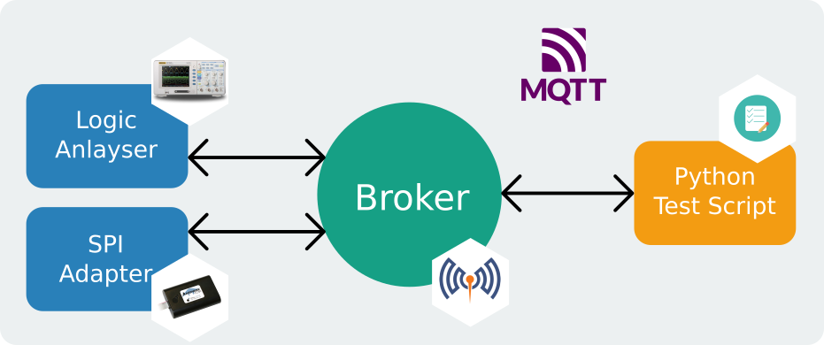
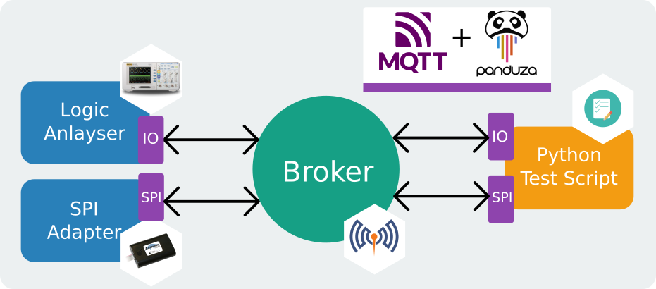

Panduza Concept
=======================================

Panduza is based on `MQTT <https://en.wikipedia.org/wiki/MQTT>`_, a commonly used protocol for IoT network.

MQTT works with 2 types of entities:

- The **Broker**: This is the bridge between all the MQTT devices, they are all connected to this central server.
- The **Clients**: Those are the MQTT devices, they can *publish* data to the broker or *subscribe* to get notified from it.

Panduza wants to use MQTT to connect equipements of an electronic lab.

For example:

- A Logic Analyser could subscribe to trigger commands and publish captures.
- A SPI/I2C adapter could subscribe to data that need to be send and publish recieved data.
- A Test Script could publish trigger events and subscribe to results.

MQTT is a great and flexible protocol but it provides so much flexibility that even for controlling a simple light there are multiple way of doing it: multiple payload (ON/OFF strings, 0/1 number or JSON), multiple way of organising topics...

Panduza provides a generic API to standardize interfaces access.

