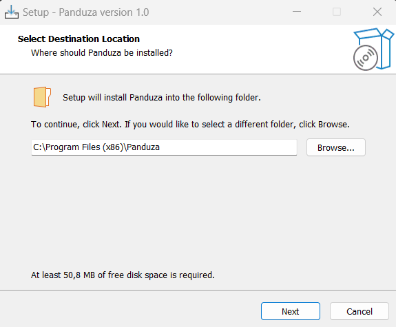
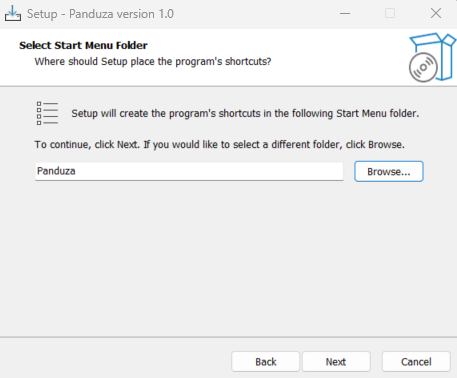
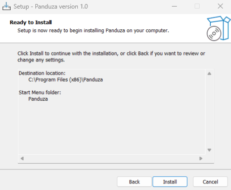
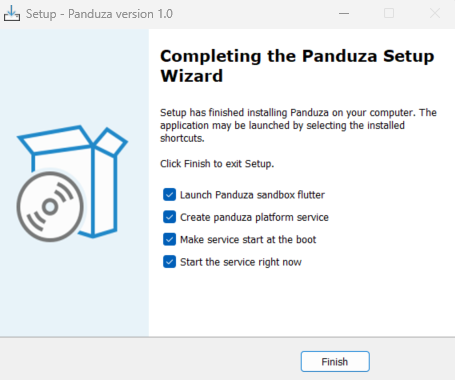

Most of electronic labs run with windows PC. Here is the page that explains how to convert it into a Panduza platform.

## A unique installer to install everything you need!

This install will install:

- The Panduza platform windows service
- The Panduza Sandbox IHM

### Step 0 : Prerequisites

- Have access to admin rights on your machine.
- Have set the Panduza config (tree.json and connection.json) : link to how to set Panduza config (create this page in the doc)

### Step 1 : Download installer

download link 

### Step 2 : Install Panduza

Choose the path where you want to install Panduza. \
Click on Install button.

  

Choose the path where the shortcuts of platform and IHM will be created. \
Click on Next button.

  

Click on Install button

  

"Launch Panduza sandbox flutter" checkbox will launch the Panduza IHM. \
"Create panduza platform service" checkbox will create the platform windows service. \
"Make service start at the boot" checkbox will start the service at every boot of the machine. \
"Start the service right now" checkbox will start the service right now, to start using panduza right away. 

  

