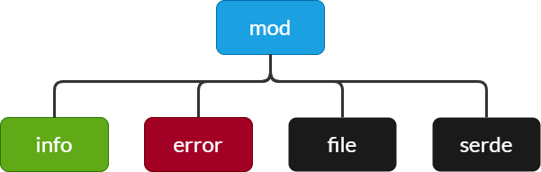

This crate manage the interaction between the platform and the 'connection.json' file.

It is composed of:

- `mod`: Public interfaces of the crate
- `info`: Holds the data structure
- `error`: Special error manager for connection info
- `file`: Manage the interaction with the file system
- `serde`: Manage the JSON content of the file

## mod

This file is the public interface of the crate.

It defines the main struct object:

- Info

And I/O function to import and export the info object from/to the file system:

- system_file_path
- import_file
- export_file

import_file function has its own result class, it allows the calling function to manage various situation we can deal with file import.

- Error
- ErrorType

