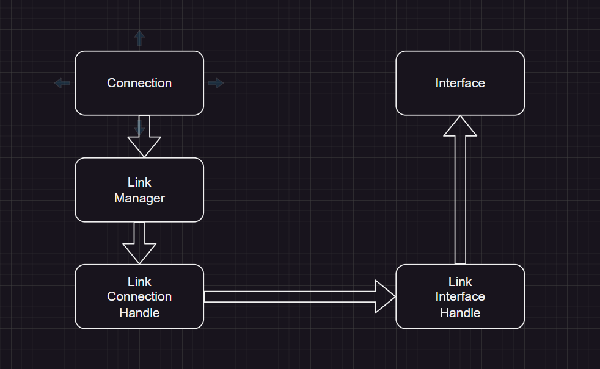

Links are a way to create a communication between MQTT connection task and interface tasks.

The link manager is in charge to create the 2 handles. 

Those handles are the 2 endpoints of a threadsafe tokio channel.

- Connection Handle: Sender
- Interface Handle: Reciever

