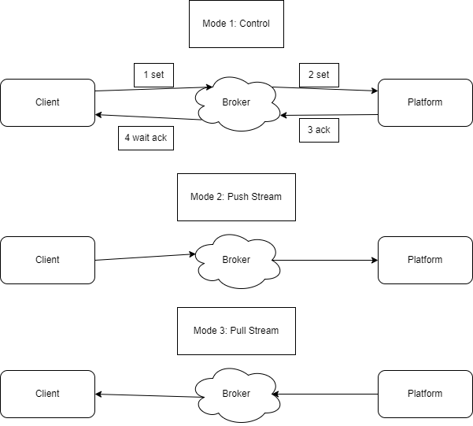

3 modes:

- M1: Control (set value and ensure the platform applied it)
- M2: Push Stream (send huge amount of data to the platform in a stream)
- M3: Pull Stream (receive huge amount of data from the platform in a stream)

## Performance Benchmarks

- C: CLIENT
- B: BROKER
- P: PLATFORM 

- NC: NUMBER OF PARALLELE CONNECTION
- NI: NUMBER OF ITERATIONS 
- PS: PAYLOAD SIZE

### Latency Metrics

- LCB: Latency between Client and Broker (use PINGREQ/PIGNRESP)
- LBP: Latency between Broker and Platform (use PINGREQ/PIGNRESP)

### M1 Perf Metrics

For M1, create `NC` clients and `NC` platforms.

When the test start, all the clients send `NI` messages with a `PS` size.

When the last ack is received, the client stop and save its time.

The test must display:

- Min time of all clients
- Max time of all clients
- Average time of all clients

### M2 Perf Metrics

In this test case, clients will send all their messages as fast as possible.

2 times must be computed.

1. client time (number of second to push all the packet)
2. platform time (number of second to recieve all the packet)

### M3 Perf Metrics

Same as M2 but reverse logic.

Must be implemeted to be able to test M2 and M3 scenarios in parallel.
