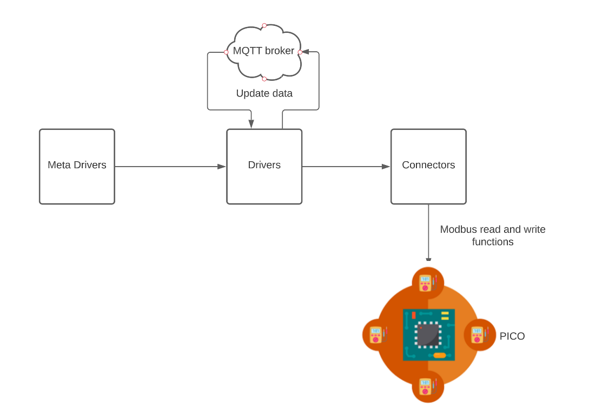

# Digital I/O Control with Raspberry Pico

This tutorial explains, step by step, how to configure a Raspberry Pico and use Panduza to perform simple DIO control.

`!!! OK POINT FIX DOC AFTER ONLY !!!`

`TODO: Improve this picture, too small on half screen, add some verticality`


# Hardware Requirements
For this project, you will need to have the following components : 
  A raspberry PI PICO

  A USB cable to connect the PC to the PICO (micro USB cable)

  One or a couple of LED's

  One or a couple of resistors

  One push button for the reset of the PICO

In this example, we will control the I:O 1, 2, 16 and 18 of the PICO MCU 


The push button will allow you to reset the PICO without unpluging the cable
.
Also, there is the following pinout of the PICO


# Software Requirements

This tutorial has been tested on Ubuntu 20.04.

Make sure you have installed the following packages : 

```bash
  sudo apt install python3-pip # will install pip3 package
  sudo pip3 install pymodbus # will install python modbus library
  sudo pip3 install pyserial # will install python serial library
  sudo apt install cmake # will install cmake. Needed to build pico binaries
  pip install -e "git+https://github.com/Panduza/panduza-py.git@main#egg=panduza&subdirectory=client" # will install python client of panduza
```

The panduza platform will also install additional packages during the build of the docker image.

The installation of the packages will manage you to control the digital io's of the PICO remotly by using the panduza ecosystem.

Panduza is the conbinations of different blocs, the client, the platform, the MQTT brocker and the configuration of the Raspberry PI PICO. We will explain each part of the chaine.


In this document, we will explain the role of each block of the panduza chain from the client to the PICO.

But first, let's look other of the modbus protocole.


# Configuration of the Raspberry PI PICO

The configuration of the PICO is a important step to control I:O. In this part, we will explain how to configure and program the PICO.

Using the MODBUS protocole to send data to the MCU, we have integrated a specific library to the PICO. This library will automaticely analyse each frame and decode them.
If you wish to have more information about the library, you can check the following link :

```bash
  https://jacajack.github.io/liblightmodbus/

```

To programme the PICO, you have to unsure, that the PICO is connected to the PC and is in the mode USB Mass Storage Device Mode.

To check this condition, you can open a terminal and run the following command : 

```bash
  lsusb
```

This command will list all the usb devices connected to the PC.


Raspberry Pi RP2 Boot show's that the PICO is in USB mode.

To flash the PICO, you will have to copie a .uf2 file to the PICO.

A .uf2 extension is a binary file witch will allow you to program a MCU over the USB port. Since the PICO is connected threw USB, you will have to flash a .uf2 file.

In our case you will have to copy the pza-pico-modbus-dio.uf2 to the PICO using the following command : 

```bash
  cp pza-pico-modbus-dio.uf2 /media/<user_name>/RPI-RP2/
```
After this, the USB mode is disabled. 
A serial port sould be opened in the /dev directory of your linux envirronment. The serial port name should be ttyACM0 or ttyACM1.

If you want to make sure, you can list all the serial ports of the /dev directory.


# Panduza client

The PICO client, is the panduza bloc from from the point of view of the user.

This part will allow you to sent various informations of each I:O (I:O 1,2,16 and 18) to the PICO via the MQTT brocker.

In this part we need to configure various informations.

The server configuration.

Configure the Topics. A topic corresponds to a path where will be stored all the data from each I:O.

```python
  var1 = 1
  var2 = 2
  var16 = 16
  var18 = 18

  # one topic per io
  pzaTOPIC1=f"pza/my_lab_server/pza_modbus_dio/My_Input_Output_GPIO{var1}"
  pzaTOPIC2=f"pza/my_lab_server/pza_modbus_dio/My_Input_Output_GPIO{var2}"
  pzaTOPIC16=f"pza/my_lab_server/pza_modbus_dio/My_Input_Output_GPIO{var16}"
  pzaTOPIC18=f"pza/my_lab_server/pza_modbus_dio/My_Input_Output_GPIO{var18}"

```

Create a instance of the Client class. This will manage the connection between your client script and the MQTT brocker.

```python
  pzaClient = Client(url=BROKER_ADDR, port=1883)
  pzaClient.connect()
```

Scanning the interfaces. This will make sure that all the topics have been created

```python
  # scan the interface
  inter = pzaClient.scan_interfaces()

  # list all the topics
  print("scanning the interfaces..")
  for topic in inter:
      print(f"- {topic} => {inter[topic]['type']}")

```

create instances of Dio. This will allow you to use the Driver class from the platform and control and I:O's of the MCU.

```python
# declare instances of dio. One per io control
  d1 = Dio(addr=BROKER_ADDR, port=BROKER_PORT, topic=pzaTOPIC1, client=pzaClient)
  d2 = Dio(addr=BROKER_ADDR, port=BROKER_PORT, topic=pzaTOPIC2, client=pzaClient)
  d16 = Dio(addr=BROKER_ADDR, port=BROKER_PORT, topic=pzaTOPIC16, client=pzaClient)
  d18 = Dio(addr=BROKER_ADDR, port=BROKER_PORT, topic=pzaTOPIC18, client=pzaClient)

```

Then we can send the data to the I:O using the set() function. The set() will write various information such as the type of output, the value or the polling_cycle of a I:O to the rigth topic of the MQTT broker.

```python
  print("setting the values for GPIO 1")
  d1.direction.value.set("toggle_led_1", ensure = False)
  time.sleep(1)
  d1.direction.pull.set("open", ensure = False)
  time.sleep(1)
  d1.direction.polling_cycle.set(10, ensure = False)
  time.sleep(1)

  d1.state.active.set(False, ensure = False)
  time.sleep(1)
  d1.state.active_low.set(True, ensure = False)
  time.sleep(1)
  d1.state.polling_cycle.set(100, ensure = False)
  time.sleep(1)

  print("setting the values for GPIO 2")
  d2.direction.value.set("toggle_led_2", ensure = False)
  time.sleep(1)
  d2.direction.pull.set("open", ensure = False)
  time.sleep(1)
  d2.direction.polling_cycle.set(10, ensure = False)
  time.sleep(1)

  d2.state.active.set(False, ensure = False)
  time.sleep(1)
  d2.state.active_low.set(True, ensure = False)
  time.sleep(1)
  d2.state.polling_cycle.set(100, ensure = False)
  time.sleep(1)

  print("setting the values for GPIO 16")
  d16.direction.value.set("toggle_led_16", ensure = False)
  time.sleep(1)
  d16.direction.pull.set("open", ensure = False)
  time.sleep(1)
  d16.direction.polling_cycle.set(10, ensure = False)
  time.sleep(1)

  d16.state.active.set(False, ensure = False)
  time.sleep(1)
  d16.state.active_low.set(True, ensure = False)
  time.sleep(1)
  d16.state.polling_cycle.set(100, ensure = False)
  time.sleep(1)

  print("setting the values for GPIO 18")
  d18.direction.value.set("toggle_led_18", ensure = False)
  time.sleep(1)
  d18.direction.pull.set("open", ensure = False)
  time.sleep(1)
  d18.direction.polling_cycle.set(10, ensure = False)
  time.sleep(1)

  d18.state.active.set(False, ensure = False)
  time.sleep(1)
  d18.state.active_low.set(True, ensure = False)
  time.sleep(1)
  d18.state.polling_cycle.set(100, ensure = False)
  time.sleep(1)
```

There is a design of how the client works.


There are various steps to configure the client.
First we configure the parameters of the MQTT broker. the address will be "localhost and the listening port is 1883.

## launch of panduza client

to lauch panduza client, you can create a script in a directory of your choice.

Run the script by using the following command : 

```bash
  python3 <script_name>.py
```

in the output command, you must have at least the following topics : 


Note that the platform must run before launching the script. Otherwise, you can have a connection error : 


# mosquitto installation

To use MQTT protocole, you will have to install the mosquitto server.

This installation will install the broker MQTT tool.

It is possible to use command lines to install the mosquitto server.

```bash
  sudo apt update # update the environment
  sudo apt install -y mosquitto # install the mosquitto package
```

To make sure mosquitto is installed, you can run the command : 

```bash
  mosquitto --version
```

you should have the following output in the terminal


Then ensure, that the mosquitto package is loaded by using the following command. 

```bash
  sudo systemctl status mosquitto
```


# Panduza platform

The panduza platform, consists on getting the data from the brocker MQTT and send data to control the I:O's of the MCU.

The platform has his own architecture, like the panduza client.


The platform has three main blocks.

The MetaDriver will manage the communication with the MQTT brocker, by reading and setting values to the MQTT brocker.
The Driver class, that is heritated from Metadriver, will implement the functions that we have created in the MeteDriver class.

Therethore, we have created a MetaDriver and Driver class to implement dio controls.

The driver will call the connector functions. The functions of the connector are related to the protocol used.
In our case, we will use the modbus functions from the pymodbus library.

The panduza platform is available in the following repository.

```bash
  git clone https://github.com/Panduza/panduza-py.git
```

Before running our platform, the image needs to be build.
To do this, you have to excecute the following command :

```bash
  ./docker.build-local.sh
```
This command will build all the commands from the DockerFile and configure our envirronment. It will create a local image that you will run when the platform is launch.


## Configuration of platform

In order to launch the platform, you need to create a workspace and put the following elements : 
One tree.json file. This json file will configure the interface you want to control and the brockers you are going to use.
One docker-compose.yml that will deploy docker applications.

You can put the following json and docker-compose.yml

```json
{
    "machine": "my_lab_server",
    "brokers": {
        "I/O driver": {
            "addr": "localhost",
            "port": 1883,
            "interfaces": [
                {
                    "name": "My_Input_Output_GPIO%r",
                    "driver": "pza_modbus_dio",
                    "repeated": [1,2,16,18]
                }
            ]
        }
    }
}

```

In the tree.json, we also specify witch I:O's we want to control with the attribut "repeated".

```yml
version: '3'
services:
  # docker compose run --service-ports mosquitto
  mosquitto:
    image: eclipse-mosquitto
    ports:
      - 1883:1883
      - 9001:9001
    volumes:
      - ./data/mosquitto.conf:/mosquitto/config/mosquitto.conf
  panduza-py-platform:
    # image: ghcr.io/panduza/panduza-py-platform:latest
    # To use your local platform build
    image: local/panduza-py-platform
    privileged: true
    depends_on: 
      - mosquitto
    network_mode: host
    volumes:
      - .:/etc/panduza
      - /run/udev:/run/udev:ro
    # command: bash
```

Make sure that you use the local image that bas been build as described above.

## RUN panduza platform

To run panduza platform, you have to put your self in the directory containing the tree.json and the docker-compose.yml.

Then excecute the following command : 

```bash
  docker compose up
```

This command will do the following tasks,

Excecute the mosquitto server

List all of the available drivers

Show the tree.json configuration

Start the interfaces for each I:O

Do the first update of the MQTT brocker

You must have the following result : 


The docker compose will do a first init of the MQTT broker. This initiation was defined in the driver function.


# Additional installation

If you wish do some debug or understand more the communication process.
You can install the mqtt-explorer software. This will allow you to have a visual comprehension about the communication between panduza and the MQTT broker.

To install MQTT broker, you need to use the following commands :

```bash
  sudo snap install mqtt-explorer # installation of MQTT explorer
```

To launch MQTT, you can either search the application in the ubuntu envirronment or use the following command line :

```bash
  mqtt-explorer
```


# ---------- old --------------------------- 

# MQTT configuration

In this part, we will see the steps to install mosquitto MQTT broker.

For this project, the server configuration will be defined as : 

```bash
  BROKER_ADDR="localhost"
  BROKER_PORT=1883
  CHECK_USER_INPUT=True
  RUN_TEST=False
```
We will be connected in localhost and the port 1883 is the default port to use mqtt protocol.

## mosquitto installation

To use MQTT protocole, you will have to install the mosquitto server.

This installation will install the broker MQTT packages.

It is possible to use command lines to install the mosquitto server.

```bash
  sudo apt update # update the environment
  sudo apt install -y mosquitto # install the mosquitto package
```

To make sure mosquitto is installed, you run the command : 

```bash
  mosquitto --version
```
you should have the following output in the terminal


Then ensure, that the mosquitto package is loaded by using the following command. 

```bash
  sudo systemctl status mosquitto
```


## installation of MQTT explorer

`TODO: Oui mais il faut montrer comment ça marche et comment on voit que ça fonctionne (mets le à la fin du tuto en bonus)`

MQTT explorer is a practical graphical tool used to testing communication via MQTT broker. With this tool, you can test the different data you have send threw your topics.

To install MQTT broker, you need to use the following commands :

```bash
  sudo snap install mqtt-explorer # installation of MQTT explorer
```

To launch MQTT, you can either search the application in the ubuntu envirronment or use the following command line :

```bash
  mqtt-explorer
```

# PANDUZA CLIENT

`TODO: Oui mais il faut montrer comment ça marche et non pas comment il est construit`

The panduza client will be the interface between the user and the panduza ecosystem.
The role of the client will be to configure various parameters to send the data of the i/o's to the correct destination.

A digital input output is has various attributs and and fields attached to the those attributs.

```python
  # === DIRECTION ===
  self.add_attribute(
     Attribute( name = "direction" )
  ).add_field(
     RwField( name = "value" )
  ).add_field(
     RwField( name = "pull" )
  ).add_field(
    RwField( name = "polling_cycle" )
  )

  # === STATE ===
  self.add_attribute(
    Attribute( name = "state" )
  ).add_field(
    RwField( name = "active" )
  ).add_field(
    RwField( name = "active_low" )
  ).add_field(
    RwField( name = "polling_cycle" )
  )
```


digital input output has two attributs : direction and state. in each attribut we can add fields that will define the direction and the state of the current I/O.

Those parameters will help us to code the driver functions to get and update the fields.

There is a functionnal python script used to send data to the  gpio 16 of pico via the MQTT broker.
We will set data to each fields by using the get() method.


```python
  from panduza import Client, Dio
  import time, logging


  # CONFIGURATION
  BROKER_ADDR="localhost"
  BROKER_PORT=1883
  CHECK_USER_INPUT=True
  RUN_TEST=False

  # one topic per io
  TOPIC16="pza/my_lab_server/pza_modbus_dio/My_Input_Output_GPIO16"


  testClient = Client(url=BROKER_ADDR, port=1883)
  testClient.connect()

  # scan the interface
  inter = testClient.scan_interfaces()

  # list all the topics
  print("scanning the interfaces..")
  for topic in inter:
      print(f"- {topic} => {inter[topic]['type']}")

    # declare instances of dio. One per io control
    d16 = Dio(addr=BROKER_ADDR, port=BROKER_PORT, topic=TOPIC16, client=testClient)

    print("setting the values for GPIO 16")
    d16.direction.value.set("toggle_led_16", ensure = False)
    time.sleep(1)
    d16.direction.pull.set("open", ensure = False)
    time.sleep(1)
    d16.direction.polling_cycle.set(10, ensure = False)
    time.sleep(1)

    d16.state.active.set(False, ensure = False)
    time.sleep(1)
    d16.state.active_low.set(True, ensure = False)
    time.sleep(1)
    d16.state.polling_cycle.set(100, ensure = False)
    time.sleep(1)

```
This script allows us to control io 16 of the PICO.

There are various steps to configure the client.
First we configure the parameters of the MQTT broker. the address will be "localhost and the listening port is 1883.

Then we declare topics. A topic is a path where the data will be send to the MQTT broker. 
In this example, we will send data to four I/O. It means that we have to create one topic per I/O/


# PANDUZA PLATFORM

`TODO: la platform il faut en parler plus tot et expliquer comment l'utiliser depuis docker, ici c'est trop complexe pour un utilisateur de partir du clone`


The panduza platform is the motor of the panduza eco-system.

It will be the interface where we will develop the drivers and various functions to send data directly to the PICO.

## Architecture of panduza platform

You will have to clone the following repository  and checkout the branch diob: 

```bash
  git clone git@github.com:Panduza/panduza-py.git
  git checkout dio
```




The meta drivers will declare the set and get functions for each io attributs. The platform will then call those functions, do a first update of the MQTT brocker. Then according to the message of the client, it will call the connector functions to write data to the PICO.

To run the panduza platform you will need to have configuration files : 

one docker-compose.yml
one tree.json

A docker-compose.yml file is a configuration file used by Docker compose. It will run container docker applications.

```yml
version: '3'
services:
  # docker compose run --service-ports mosquitto
  mosquitto:
    image: eclipse-mosquitto
    ports:
      - 1883:1883
      - 9001:9001
    volumes:
      - ./data/mosquitto.conf:/mosquitto/config/mosquitto.conf
  panduza-py-platform:
    # image: ghcr.io/panduza/panduza-py-platform:latest
    # To use your local platform build
    image: local/panduza-py-platform
    privileged: true
    depends_on: 
      - mosquitto
    network_mode: host
    volumes:
      - .:/etc/panduza
      - /run/udev:/run/udev:ro
    # command: bash
```
The most important parameter it image. In this case we will use the local image.

A tree.json file is a specific file in the panduza eco-system. This is used to configure the interfaces to be managed and the associated brokers.
```json
{
    "machine": "my_lab_server",
    "brokers": {
        "I/O driver": {
            "addr": "localhost",
            "port": 1883,
            "interfaces": [
                {
                    "name": "My_Input_Output_GPIO%r",
                    "driver": "pza_modbus_dio",
                    "repeated": [1,2,16,18]
                }
            ]
        }
    }
}
```
For this purpose, we will use the pza_modbus_dio driver witch was declared in the panduza platform driver. 
Also, since a driver is used to control a single IO. The field "repeated" will manage us to declare various instances of a same driver. This tree.json will control GPIO 1, 2, 16 and 18.


# PICO CONFIGURATION

The first step will be the configuration of the PICO so that it can receive data in modbus protocol

The firmware uses a library call liblightmodbus.

Ligthmodbus is a way to integrate modbus fonctionnalities in a embedded platform. The powerfull library allow's us to
configure platforms as master or slaves. In our example, the pico will be the slave.
But the most important is that the library is able to reconize and parse modbus RTU frame. Thanks to that, the firmware will no longer
have to check what type of frame is received.

A first version of the firmware has already been developped by our panduza developpers team.

in a directory clone the following repository :

```bash
  git clone git@github.com:Panduza/panduza-adapters-sdk.git # ssh key needed
```
The repository has various branches.
You need to checkout the following branch :

```bash
  git checkout 2-issue-sur-les-déclarations-des-interfaces-cdc
```

## how to build the project

in the root of the directory you will have to do to the following directory : 

```bash
  cd examples/pza-pico-modbus-dio
```

Once you are in this directory you can do the following steps to build the project

### Make sure cmake is installed ! 
```bash
  cmake --version
```

### How to build
```bash 
  mkdir build && cd build && cmake .. && make # this may take some time.
```
the following command will generate binary files.
In order to program the PICO, you will have to drop the .uf2 file to the pico.

In order to do this, you need to check the following requirements : 
the PICO is in boot mode.

to make sure type lsusb command in linux terminal and you should see the following line : 

```bash
  Bus 001 Device 018: ID 2e8a:0003 Raspberry Pi RP2 Boot
```

The PICO is now ready to get data from panduza platform.


# RUN PROJECT

Now that the pico is programmed and able to receive data threw modbus. 
We can now run the panduza platform and client.

To run the ecosystem you first need to program the PICO. Then you have to run the platform and excecute the client.

## RUN panduza platform

to run the panduza platform, you first need to build the docker image.

in the panduza-py repository. Go to the platform directory and build the image

```bash
  cd panduza-py/platform # move to platform dir
  ./docker.build-local.sh # build the image
```

The first build may take some time.
Note, the following command can be used if you with rebuild completely the image : 

```bash
  docker build --no-cache --tag local/panduza-py-platform:latest .
```
Once the image is build. You can run the platform.
For this, go to the /deploy/etc_deploy directory

```bash
  cd deploy/etc_panduza
```

then excecute the following command to run the panduza platform

```bash
  docker compose up
```

You must have the following result : 


The docker compose will do a first init of the MQTT broker. This initiation was defined in the driver function.


Make sure you the topics are visible with the rigth data.


## RUN panduza client

To run the client, you need to run a client script.
This script can be modify and adaptable for your own purpose.
But it must follow the following architecture.


Note that one declaration of a topic and Dio interface is used to control a single IO. 
Therefore, if you wish control multiple digital inputs outputs, you will jave to declare various topics and Dio interfaces

The topics declared must match with the topics visible in the mqtt explorer.

A script example is available in the client configuration and explication.

