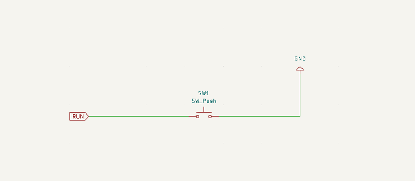
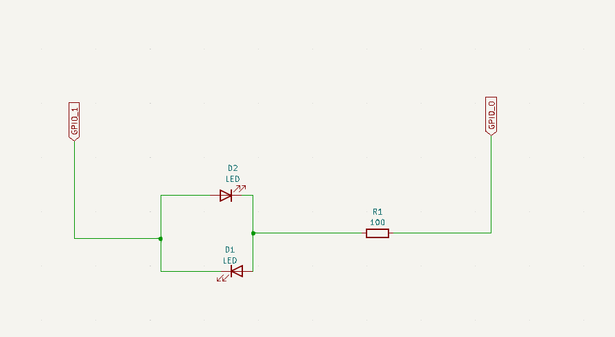
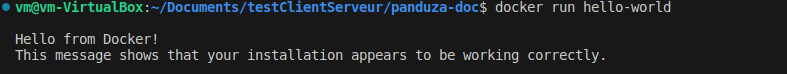
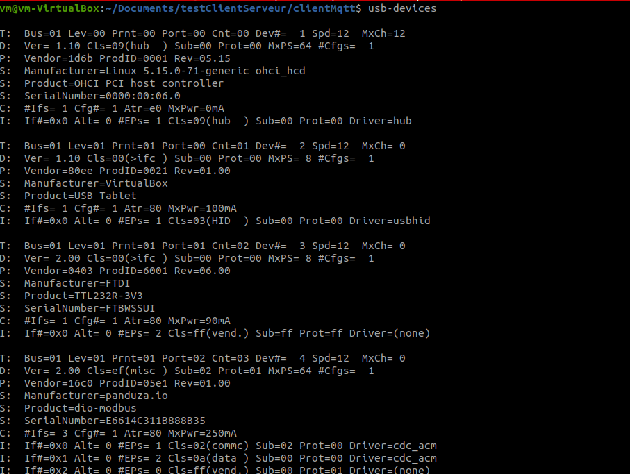
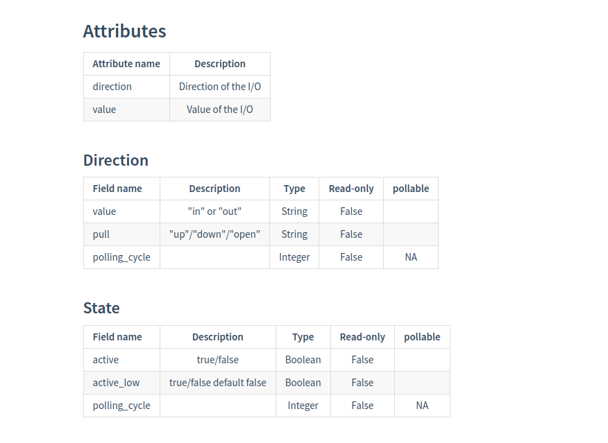
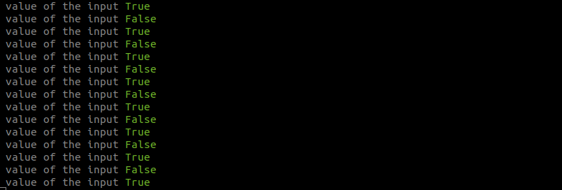
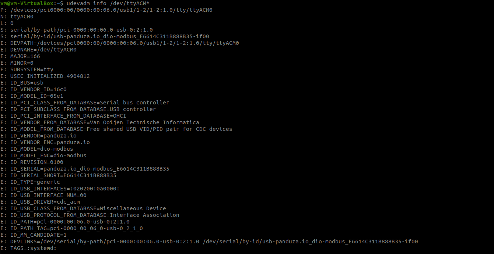
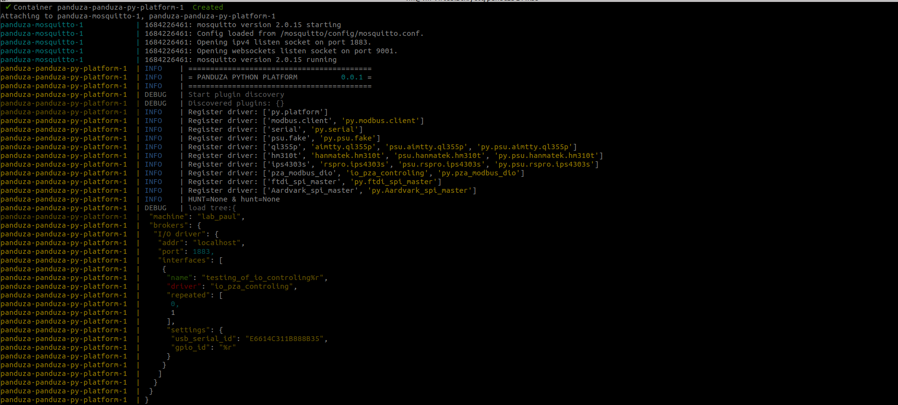
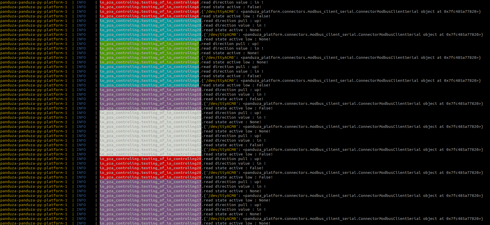

# Digital I/O Control with Raspberry Pico

This tutorial explains, step by step, how to configure a Raspberry Pico and use Panduza to perform simple DIO control.


## Hardware Requirements

For this project, you will need to have the following components : 

- 1 raspberry PI PICO
- 1 USB cable to connect the PC to the PICO (micro USB cable)
- 2 LEDs
- 1 resistor of 1Kohms maximum
- 1 push button for reset

You can use the following schematic to connect the push button to the PICO. It will be helpful to reset the pico board.

`!!! OK POINT FIX DOC AFTER ONLY !!!`

```
!!!!! A CORRIGER

SCHEMA FAUX ! court circuit entre le 3.3 et le GND...
```



You can refer to the pinout below to see where is the RUN PIN on the PICO.

In this example, we will control two digital inputs and outputs, GPIO 0 and GPIO 1. There will be connected.

The GPIO 0 will be set as the output and the GPIO 1 as the input.

To do this, you can do the schematic the following schematic to control one IO: 



If the GPIO_O is set to one, GPIO_1 should be set to one also.

To control various I:O's, you can reproduce the schematic. The resistor value is 100 ohms.

The push button will allow you to reset the PICO without unplugging the usb cable.

There is a complete schematic with the pinout of the PICO

```
!!!!! A CORRIGER

SCHEMA FAUX ! court circuit entre le 3.3 et le GND...
```


## Software Requirements

This tutorial has been tested on Ubuntu 20.04 and 22.04 virtual machine.

To configure the environment, you must follow the following steps : 

### Update your Ubuntu environment first

```bash 
  sudo apt-get update
  sudo apt-get upgrade
```

### Install necessary packages

Make sure you have installed the following packages : 

```bash
  sudo apt-get install python3-pip # will install pip3 package
  sudo apt install git # install git package
  pip install -e "git+https://github.com/Panduza/panduza-py.git@main#egg=panduza&subdirectory=client" # will install python client of panduza
```

Python is already installed on Ubuntu distribution, you won't have to reinstall it.

You will also have to install docker, it's a bit harder to install. You can follow the steps below to guide you.

### installation of docker

You will have to install docker. Docker is a powerful tool that will contain all the application project. 

We will install docker using the apt repository

First, update the apt package and do the following command 

```bash
  sudo apt-get update
  sudo apt-get install ca-certificates curl gnupg
```

Add docker's official GPG key : 

```bash
  sudo install -m 0755 -d /etc/apt/keyrings
  curl -fsSL https://download.docker.com/linux/ubuntu/gpg | sudo gpg --dearmor -o /etc/apt/keyrings/docker.gpg
  sudo chmod a+r /etc/apt/keyrings/docker.gpg
```

Then execute the following command to set up the repository : 

```bash
echo \
  "deb [arch="$(dpkg --print-architecture)" signed-by=/etc/apt/keyrings/docker.gpg] https://download.docker.com/linux/ubuntu \
  "$(. /etc/os-release && echo "$VERSION_CODENAME")" stable" | \
  sudo tee /etc/apt/sources.list.d/docker.list > /dev/null
```

Then, do an update of the apt package : 

```bash
 sudo apt-get update
```

**Now the environment is ready to install the docker engine.**


Use the following command, this will install the packages you will need to run the platform : 

```bash
 sudo apt-get install docker-ce docker-ce-cli containerd.io docker-buildx-plugin docker-compose-plugin
```

**If you want to have more info about how to install docker, I recommend you to check the following site :**

```bash
 https://docs.docker.com/engine/install/ubuntu/
```


**You might have permission issues if you try to build a docker image**. To resolve this issue, I recommend you to run the following commands : 

```bash
  sudo groupadd docker
  sudo usermod -aG docker $USER
  newgrp docker
```


Then restart your Linux environment :

```bash
  sudo reboot
```

Once the system has rebooted, you can run a docker image to see if docker is correctly installed.

```bash
 docker run hello-wold
```

You should have the following output




Docker is correctly installed in your environment.


As mentioned in the beginning, Panduza is the combination of different blocs, the client, the platform and the configuration of the Raspberry PI PICO. 

We will explain each part of the chain.

## Configuration of the Raspberry PI PICO

The configuration of the PICO is an important step of the project.

First of all, you need to program the PICO with the firmware: [**pza-pico-modbus-dio.uf2**](https://github.com/Panduza/panduza-adapters-sdk/releases/tag/v0.0.2)

To program the PICO, you have to ensure that the PICO is connected to the PC and is in the mode USB Mass Storage Device mode.

To be in USB mass storage mode, you will have to press the push button and the bootsell button (white button) on the PICO. After a couple of seconds, you should be in

To check you are in usb mode, you must run the following command

```bash
  lsusb
```

This command will list all the USB devices connected to the PC.


**Raspberry Pi RP2 Boot** show's that the PICO is in USB mass storage mode.

To flash the PICO, you will have to copy a binary file with the .uf2 extension.

A .uf2 extension is a binary file that will allow you to program an MCU over the USB port. Since the PICO is connected threw USB, you will have to flash a .uf2 file.

In our case you will have to copy the **pza-pico-modbus-dio.uf2** to the PICO using the following command : 

```bash
  cp pza-pico-modbus-dio.uf2 /media/<user_name>/RP2_RPI
```

After this, the USB mode is disabled.

The name of the pico when programmed is **panduza.io dio-modbus**, his vendor id is **16c0** and id product **05e1**

You can use usb-devices command to check if a USB device with the vendor, product and name is available.


```
!!!!! A CORRIGER
Dans ta capture d'écran on voit pas panduza.io... ?
corrigé.
```


```bash
  usb-devices
```



**Make sure you have a usb manufacture name panduza.io, with the vendor id is 16c0 and product id is 05e1**

A serial port should be opened in the /dev directory of your Linux environment. The serial port name should be **ttyACM0** or **ttyACM1**.

If you want to make sure that the ports exist, you can list all the serial ports of the /dev directory.


```bash
  cd /dev
  ls devttyACM*
```
The port open should be ttyACM0 or ttyACM1


# Panduza client


This part will allow you to send various information about each I:O (GPIO 0 in our case) to the PICO.

To do this, we first have to understand the different parameters of a io :

<p> The direction of the IO. "in" for input, "out" for output </p>
<p> the pull value. It's the configuration of a input. it's ether "up", "down" or "open"</p>
<p> The value represented by the active state </p>
<p> active_low. True or False. by default, it is set to false. </p>



Also, we can configure a polling cycle. The polling cycle is the time between two acquisitions. This time is measured in seconds.


In our example, we want to control the input GPIO_1 which is wired with the GPIO_0 configured as a output.

To do this we will write to the GPIO_0 by setting the state active to **True**. In the Input, the active state should be set to True also.

But first, we have to do various configurations;

**Configure the server**

```python
BROKER_ADDR="localhost"
BROKER_PORT=1883 # mqtt protocol port
```

**Configure the Topics**

A topic corresponds to a path where will be stored all the data from each I:O.

To load the Topics, we have used aliases : 

```python
Core.LoadAliases({
    "local": {
        "url": "localhost",
        "port": 1883,
        "interfaces": {}
    }
})
```


**Do a first connexion test**

```python
  pzaPaulClient = Client(broker_alias="local")
  pzaPaulClient.connect()
```

**Scanning the interfaces**

This will make sure that all the topics have been created. There is an example of a message you must see in the output of your terminal


```python
for topic in inter:
    if str(inter[topic]['type']).rjust(10) == str('       DIO'): # load the DIO topics from json

        print(f"list of the TOPICS => {topic}")
        getioNumber = topic.split(topicBegin)[1]
        toInt = int(getioNumber)
        num.append(toInt)

print(num)
print("\033[92msorting array of topics\033[0m")
sort = sorted(num)
print(sort)
```

On the output of the terminal, you need to see all the declared Dio topics.


**Create instances of DIO**

Then create instances of Dio. This will allow you the user to use the function of the drivers

```python
# declare instances of dio. One per io control
d0 = Dio(addr=BROKER_ADDR, port=BROKER_PORT, topic=f"pza/lab_paul/io_pza_controling/testing_of_io_controling-{sort[0]}", client=pzaPaulClient)
d1 = Dio(addr=BROKER_ADDR, port=BROKER_PORT, topic=f"pza/lab_paul/io_pza_controling/testing_of_io_controling-{sort[1]}", client=pzaPaulClient)
```

**Then we can start sending data to the output**

```python
while True:
    try:
        d0.direction.value.set("out")
        d1.direction.value.set("in")
        d.direction.pull.set("up")

        d0.direction.polling_cycle.set(1)
        d0.state.polling_cycle.set(1)
        d1.direction.polling_cycle.set(1)
        d1.state.polling_cycle.set(1)


        d0.state.active_low.set(False)
        d0.state.active.set(True)
        time.sleep(1)
        print(f" value of the input {d1.state.active.get()}")
        time.sleep(1)
        d0.state.active.set(False)
        time.sleep(1)
        print(f" value of the input {d1.state.active.get()}")
        time.sleep(1)
    except: # reset all the state of io's
       d0.state.active.set(False)
       d1.state.active.set(False)
       exit()

```

To set the output to one, we have to send True in the state active field.

To check if the input, is passed to True, we have to use the get() function, which will allow you read the value of the state active of the input

```python
  print(d1.state.active.get())
```

You should have the following result in the terminal



To understand more about how the client works, there is an example of the architecture of how it works.


## launch of Panduza client

To launch the script clone the repo using the following command : 

```bash
git clone https://github.com/MageTomcat14/pza_client_dio.git
```

Run the script by using the following command : 

```bash
  python3 client.py
```

Note that the platform must run before launching the script. Otherwise, you can have a connection error : 


We will see now how to configure the platform

# Panduza platform

The Panduza platform consists of getting the data from the broker MQTT and sending data to control the I:O's of the MCU.

Like the Panduza client, the platform has its architecture.


The Panduza platform is available in the following repository.

```bash
  git clone https://github.com/Panduza/panduza-py.git
```

Before running our platform, the image needs to be built.

To do this, you have to execute the following command (this may take some time for the first build) :

```bash
  cd panduza-py
  ./platform/docker.build-local.sh
```

This command will configure your project environment. It will create a local image (local/panduza-py-platform) that you will run when the platform is launched.


## Configuration of platform

Create the panduza directory in the /etc directory : 

```bash
cd /etc
sudo mkdir /panduza
```

in the /platform/deploy directory of the platform repository, run the following bash script

```bash
  cd /platform/deploy
  chmod 777 setup_panduza_etc
  ./setup_panduza_etc.sh
```

After, go to the etc/panduza directory of your environment. You will find a tree.json configuration file and a docker-compose.yml.


You can put the following JSON and docker-compose.yml

You might have to set permissions to write to the docker-compose and tree.json configuration files


```bash
  sudo chmod 777 tree.json docker-compose.yml
```

Modify the two files : 

**tree.json**
```json
{
    "machine": "lab_paul",
    "brokers": {
        "I/O driver": {
            "addr": "localhost",
            "port": 1883,
            "interfaces": [
                {
                    "name" : "testing_of_io_controling%r",
                    "driver" : "io_pza_controling",
                    "repeated":[0,1],
                    "settings":
                    {
                        "usb_serial_id" : "E6614C311B888B35",
                        "gpio_id" : "%r"
                    }
                }
            ]
        }
    }
}
```

**docker-compose.yml**
```yml
version: '3'
services:
  # docker compose run --service-ports mosquitto
  mosquitto:
    image: eclipse-mosquitto
    ports:
      - 1883:1883
      - 9001:9001
    volumes:
      - ./data/mosquitto.conf:/mosquitto/config/mosquitto.conf
  panduza-py-platform:
    # image: ghcr.io/panduza/panduza-py-platform:latest
    # To use your local platform build
    image: local/panduza-py-platform
    privileged: true
    depends_on: 
      - mosquitto
    network_mode: host
    volumes:
      - .:/etc/panduza
      - /run/udev:/run/udev:ro
    # command: bash
```

The repeated attribute will allow you to declare various instances of the dio driver, in our case, we will only create two instances for the GPIO_0 and GPIO_1.

In the tree.json you will put specific information about the pico and how many I:O's you want to control. Therefore, this JSON file might change according to your purpose.

Make sure that you use the local image that has been built as described above.

To check the serial id of your pico, you can do the following command : 


```bash
  udevadm info dev/ttyACM*
```

Then look for the ID_SERIAL_SHORT field. Past this id in the usb_serial_id field




Now, you can run the platform : 


## RUN panduza platform

To run the Panduza platform, stay in the /etc/panduza directory of your linux system.

Then execute the following command : 

```bash
  docker compose up
```

The first time you run **docker compose up** command, the  following tasks will be executed:

Install and execute the mosquitto server

List all of the available drivers

Show the tree.json configuration

Start the interfaces for each I:O

Do the first update of the MQTT broker

You must have the following result : 



The docker-compose will do a first init of the MQTT broker.




# RUN PANDUZA

To run correctly the project, you need to respect the following order

**<p>Program the PICO</p>**
```bash
cp pza-pico-modbus-dio.uf2 /media/<user_name>/RP2_RPI
```

**<p>launch the platform</p>**
```bash
./platform/docker.build-local.sh
cd /etc/panduza
docker compose up

```
**<p>run the client script</p>**
```bash
  python3 client.py
```


Now, Panduza should run and control the IOs of the PICO


# Additional requirements

If you wish do some debugging or understand more the communication process.
You can install the MQTT-explorer software. This will allow you to have a visual comprehension of the communication between Panduza and the MQTT broker.

To install the MQTT broker, you need to use the following commands :

```bash
  sudo snap install mqtt-explorer # installation of MQTT explorer
```

To launch MQTT, you can either search the application in the Ubuntu environment or use the following command line :

```bash
  mqtt-explorer
```

You can also install the minicom package to view data threw a serial port. This can be used for debugging purposes

```bash
  sudo apt install minicom
  sudo minicom -D /dev/ttyACM0 -b 115200 # see serial port data
```