# Digital I/O Control with Raspberry Pico

This tutorial explains, step by step, how to configure a Raspberry Pico and use Panduza to perform simple DIO control.

`!!! OK POINT FIX DOC AFTER ONLY !!!`

`TODO: Improve this picture, too small on half screen, add some verticality`

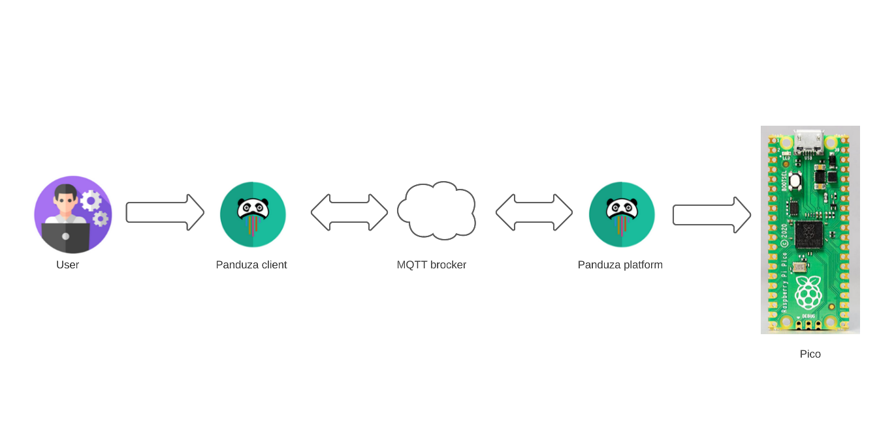


# Hardware Requirements

For this project, you will need to have the following components : 

<p> 1 raspberry PI PICO</p>
<p> 1 USB cable to connect the PC to the PICO (micro USB cable)</p>
<p> 10 LED's</p>
<p> 6 resistors of 1Kohms maximum </p>
<p> 1 push button</p>

In this example, we will control the GPIO 1, 11, 17, 20 and 27of the PICO MCU by sending data to GPIO 0,10,16, 21 and 28 witch will be configured in outputs.

To do this, you can do the schematic the following schematic to control one IO: 

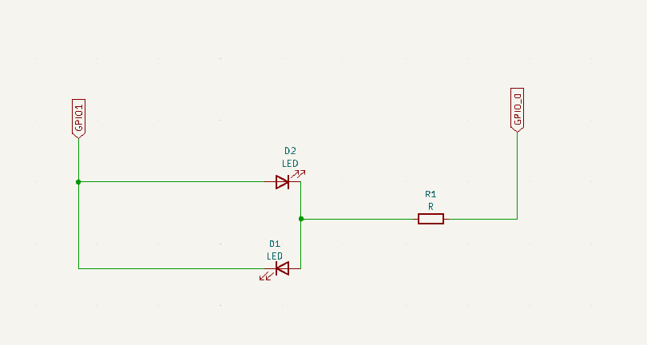

If the output is set to one, the LED D1 will turn on.

To control various I:O's, you can reproduce the schematic. The resistor value is 1 Kohms.

The push button will allow you to reset the PICO without unpluging the cable.

Also, there is the following pinout of the PICO

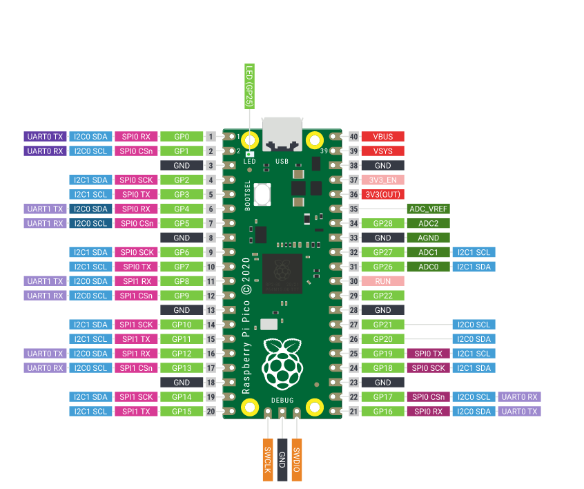


# Software Requirements

This tutorial has been tested on Ubuntu 20.04 virtual machine.

Make sure you have installed the following packages : 

```bash
  sudo apt install python3-pip # will install pip3 package
  sudo pip3 install pymodbus # will install python modbus library
  sudo pip3 install pyserial # will install python serial library
  sudo apt install cmake # will install cmake. Needed to build pico binaries
  pip install -e "git+https://github.com/Panduza/panduza-py.git@main#egg=panduza&subdirectory=client" # will install python client of panduza
```
Python is already installed on ubuntu distribution, you won't have to re-install it.

As mentionned in the beggining, panduza is the conbinations of different blocs, the client, the platform, the MQTT brocker and the configuration of the Raspberry PI PICO. We will explain each part of the chaine.

# Configuration of the Raspberry PI PICO

The configuration of the PICO is a important step of the project.

As we are using the MODBUS protocole to send data to the MCU, we have integrated a specific library to the PICO. The goal of this library will be to detecte all types of data and decode each frame.

If you wish to have more information about the library, you can check the following link :

```bash
  https://jacajack.github.io/liblightmodbus/
```


To program the PICO, you have to unsure that the PICO is connected to the PC and is in the mode USB Mass Storage Device mode.
It can also program the PICO using the serial wire Debug port. In our case, we will use the usb mode.

This mode indicats that the micro controller is ready to be programed.

To check that you are in USB mass storage Device Mode, you can open a terminal and run the following command : 

```bash
  lsusb
```

This command will list all the usb devices connected to the PC.

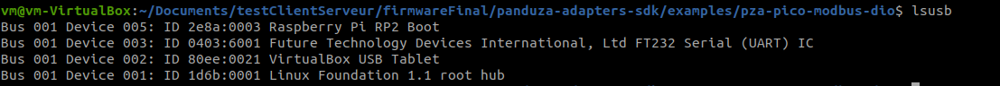

**Raspberry Pi RP2 Boot** show's that the PICO is in USB mass storage mode.

To flash the PICO, you will have to copie a binary file with the .uf2 extension.

A .uf2 extension is a binary file witch will allow you to program a MCU over the USB port. Since the PICO is connected threw USB, you will have to flash a .uf2 file.

In our case you will have to copy the **pza-pico-modbus-dio.uf2** to the PICO using the following command : 

```bash
  cp pza-pico-modbus-dio.uf2 /media/<user_name>/RPI-RP2/
```

After this, the USB mode is disabled.

The name of the pico when programed is **panduza.io dio-modbus**.

A serial port sould be opened in the /dev directory of your linux envirronment. The serial port name should be **ttyACM0** or **ttyACM1**.

If you want to make sure, you can list all the serial ports of the /dev directory.


```bash
  cd /dev
  ls devttyACM*
```

To reset the MCU, you need to press on the push button and the bootsel button of the MCU. This will erase the software from the flash and after a couple of seconds the PICO will be back in USB mass storage mode.

**pza-pico-modbus-dio.uf2** is available in the following repository in the action menu of github : 

```bash
  https://github.com/Panduza/panduza-adapters-sdk.git
```

Then choose the last workflow and download the .uf2 and program the PICO.

# Panduza client

The PICO client is the panduza bloc from from the point of view of the user.

This part will allow you to sent various informations of each I:O (GPIO 0,10,16,21 and 28) to the PICO via the MQTT brocker.

In this part we need to configure various informations.

The server configuration.

Configure the Topics. A topic corresponds to a path where will be stored all the data from each I:O.

```python
var0 = 0
var10 = 10
var16 = 16
var21 = 21
var28 = 28

# one topic per io
pzaTOPIC0=f"pza/my_lab_server/pza_modbus_dio/My_Input_Output_GPIO{var0}"
pzaTOPIC10=f"pza/my_lab_server/pza_modbus_dio/My_Input_Output_GPIO{var10}"
pzaTOPIC16=f"pza/my_lab_server/pza_modbus_dio/My_Input_Output_GPIO{var16}"
pzaTOPIC21=f"pza/my_lab_server/pza_modbus_dio/My_Input_Output_GPIO{var21}"
pzaTOPIC28=f"pza/my_lab_server/pza_modbus_dio/My_Input_Output_GPIO{var28}"
```

Create a instance of the Client class. This will manage the connection between your client script and the MQTT brocker.

```python
  pzaClient = Client(url=BROKER_ADDR, port=1883)
  pzaClient.connect()
```

Scanning the interfaces. This will make sure that all the topics have been created.There is a example of message you must see.

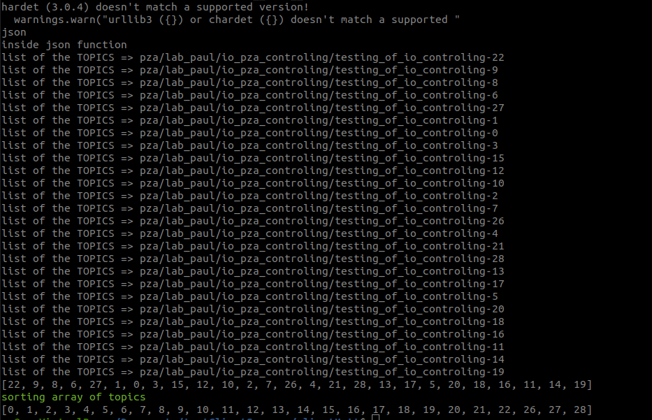

```python
  # scan the interface
  inter = pzaClient.scan_interfaces()

  # list all the topics
  print("scanning the interfaces..")
  for topic in inter:
      print(f"- {topic} => {inter[topic]['type']}")
```

On the output of the terminal, you need to see all the declared topics.


create instances of Dio. This will allow you to use the Driver class from the platform and send info to the MQTT brocker to and control I:O's of the MCU.

```python
# declare instances of dio. One per io control
d0 = Dio(addr=BROKER_ADDR, port=BROKER_PORT, topic=pzaTOPIC0, client=pzaClient)
d10 = Dio(addr=BROKER_ADDR, port=BROKER_PORT, topic=pzaTOPIC10, client=pzaClient)
d16 = Dio(addr=BROKER_ADDR, port=BROKER_PORT, topic=pzaTOPIC16, client=pzaClient)
d21 = Dio(addr=BROKER_ADDR, port=BROKER_PORT, topic=pzaTOPIC21, client=pzaClient)
d28 = Dio(addr=BROKER_ADDR, port=BROKER_PORT, topic=pzaTOPIC28, client=pzaClient)


print("setting the values for GPIO 1")
d0.direction.value.set(0)
time.sleep(1)
d0.direction.pull.set("open")
time.sleep(1)
d0.direction.polling_cycle.set(10)
time.sleep(1)

d0.state.active.set(False )
time.sleep(1)
d0.state.active_low.set(True )
time.sleep(1)
d0.state.polling_cycle.set(100)
time.sleep(1)

print("setting the values for GPIO 2")
d10.direction.value.set(10 )
time.sleep(1)
d10.direction.pull.set("open" )
time.sleep(1)
d10.direction.polling_cycle.set(10)
time.sleep(1)

d10.state.active.set(False)
time.sleep(1)
d10.state.active_low.set(True )
time.sleep(1)
d10.state.polling_cycle.set(100 )
time.sleep(1)

print("setting the values for GPIO 16")
d16.direction.value.set(16 )
time.sleep(1)
d16.direction.pull.set("open"  )
time.sleep(1)
d16.direction.polling_cycle.set(10 )
time.sleep(1)

d16.state.active.set(False )
time.sleep(1)
d16.state.active_low.set(True  )
time.sleep(1)
d16.state.polling_cycle.set(100  )
time.sleep(1)

print("setting the values for GPIO 21")
d21.direction.value.set(21)
time.sleep(1)
d21.direction.pull.set("open" )
time.sleep(1)
d21.direction.polling_cycle.set(10  )
time.sleep(1)

d21.state.active.set(False  )
time.sleep(1)
d21.state.active_low.set(True )
time.sleep(1)
d21.state.polling_cycle.set(100)
time.sleep(1)


print("setting the values for GPIO 28")
d28.direction.value.set(28)
time.sleep(1)
d28.direction.pull.set("open" )
time.sleep(1)
d28.direction.polling_cycle.set(10  )
time.sleep(1)

d28.state.active.set(False  )
time.sleep(1)
d28.state.active_low.set(True )
time.sleep(1)
d28.state.polling_cycle.set(100)
time.sleep(1)
```

To understand more how the client works, there is a example of architecture of how it works.

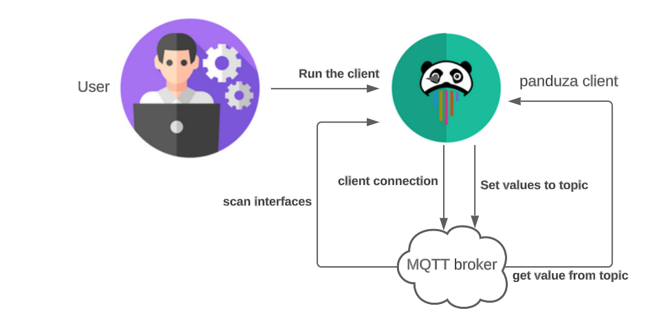


## launch of panduza client

to lauch panduza client, you can create a script in a directory of your choice.

Run the script by using the following command : 

```bash
  python3 <script_name>.py
```
The LED's 1,11,17,20 and 27 should turn on.

Note that the platform must run before launching the script. Otherwise, you can have a connection error : 

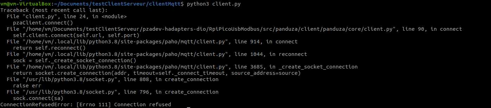


# mosquitto installation

To use MQTT protocole, you will have to install the mosquitto server.

This installation will install the broker MQTT tool.

It is possible to use command lines to install the mosquitto server.

```bash
  sudo apt update # update the environment
  sudo apt install -y mosquitto # install the mosquitto package
```

To make sure mosquitto is installed, you can run the command : 

```bash
  mosquitto --version
```

you should have the following output in the terminal


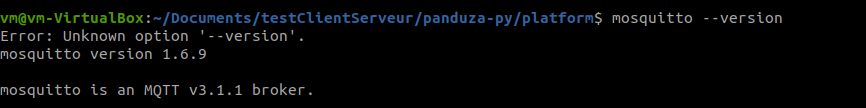

Then ensure, that the mosquitto package is loaded and inactive by using the following command. 

```bash
  sudo systemctl status mosquitto
```
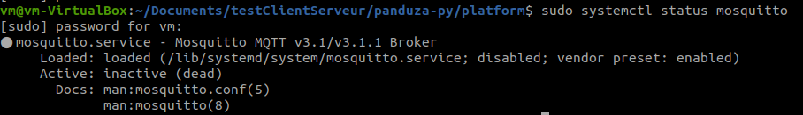

The mosquitto server will be active when the platform is launched.


# Panduza platform

The panduza platform, consists on getting the data from the brocker MQTT and send data to control the I:O's of the MCU.

Like the panduza client, the platform has his own architecture.

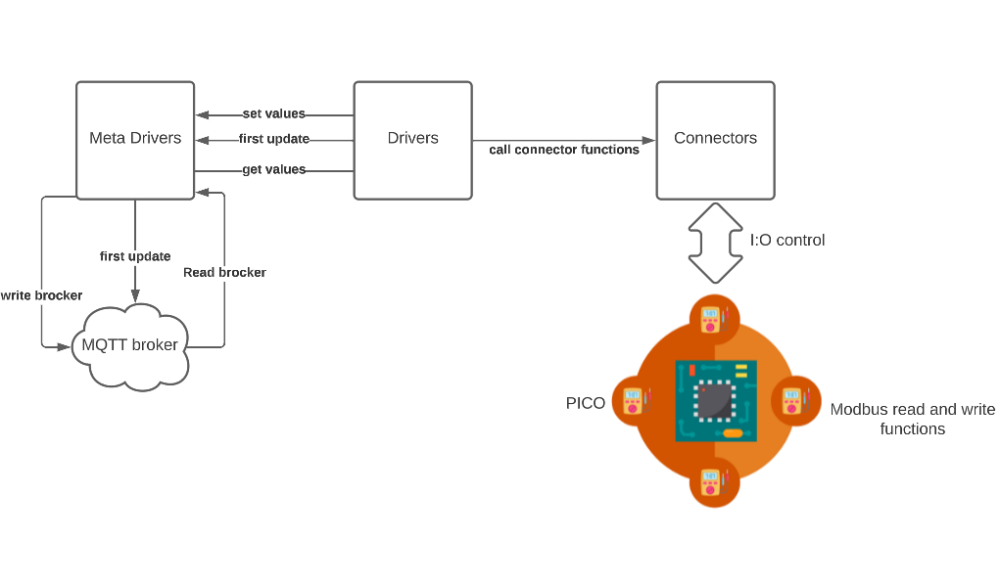

The platform has three main blocks.

<p>The MetaDriver will manage the communication with the MQTT brocker, by reading and setting values to the MQTT brocker.</p>
<p>The Driver class, that is heritated from Metadriver, will implement the functions that we have created in the MeteDriver class.</p>
<p>The connector, will contain the functions to transfer or read data from the MCU</p>.
Therethore, we have created a MetaDriver and Driver class to implement dio controls.

The driver will call the connector functions. The functions of the connector are related to the protocol used.
In our case, we will use the modbus functions from the pymodbus library.

The panduza platform is available in the following repository.

```bash
  git clone https://github.com/Panduza/panduza-py.git
```

Before running our platform, the image needs to be build.

To do this, you have to excecute the following command :

```bash
  ./platform/docker.build-local.sh
```
This command will configure your project environment. It will create a local image that you will run when the platform is launch.

Then you will have to configure your platform : 

## Configuration of platform

In order to launch the platform, you need to create a workspace and put the following elements :

**<p>One tree.json file. This json file will configure the interface you want to control and the brockers you are going to use.</p>**
**<p>One docker-compose.yml that will deploy docker application.</p>**

You can put the following json and docker-compose.yml


```json
{
    "machine": "my_lab_server",
    "brokers": {
        "I/O driver": {
            "addr": "localhost",
            "port": 1883,
            "interfaces": [
                {
                    "name": "My_Input_Output_GPIO%r",
                    "driver": "pza_modbus_dio",
                    "repeated": [0,1,2,3,4,5,6,7,8,9,10,11,12,13,14,15,16,17,18,19,20,21,22,26,27,28],
                    "settings":
                    {
                        "usb_serial_id":"E6614C311B888B35" 
                    }
                }
            ]
        }
    }
}
```
The repeated attribut will allow you to declare various instances of the dio driver. In the tree.json you will put specific information about the pico and how many I:O's you want to control. Therefore, this json file can be modified.


**One driver will control one GPIO**

Therefore, the tree.json will instance one driver for each GPIO.

```yml
version: '3'
services:
  # docker compose run --service-ports mosquitto
  mosquitto:
    image: eclipse-mosquitto
    ports:
      - 1883:1883
      - 9001:9001
    volumes:
      - ./data/mosquitto.conf:/mosquitto/config/mosquitto.conf
  panduza-py-platform:
    # image: ghcr.io/panduza/panduza-py-platform:latest
    # To use your local platform build
    image: local/panduza-py-platform
    privileged: true
    depends_on: 
      - mosquitto
    network_mode: host
    volumes:
      - .:/etc/panduza
      - /run/udev:/run/udev:ro
    # command: bash
```

Make sure that you use the local image that bas been build as described above.

## RUN panduza platform

To run panduza platform, you have to put your self in the directory containing the tree.json and the docker-compose.yml.

Then excecute the following command : 

```bash
  docker compose up
```

This command will do the following tasks,

Excecute the mosquitto server

List all of the available drivers

Show the tree.json configuration

Start the interfaces for each I:O

Do the first update of the MQTT brocker

You must have the following result : 

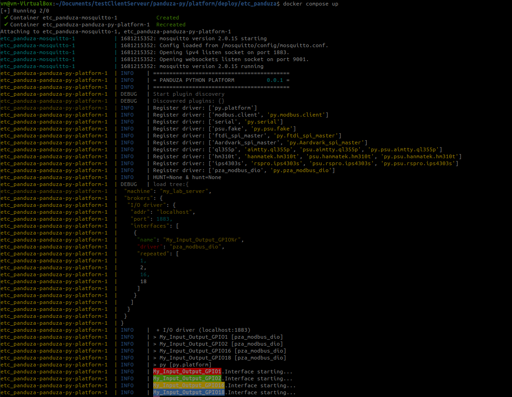

The docker compose will do a first init of the MQTT broker.

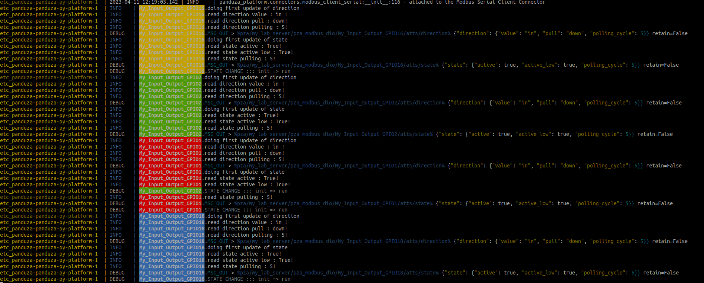


# RUN PANDUZA

To run correctly the project, you need to respect the following order

**<p>Program the PICO</p>**
**<p>launch the platform</p>**
**<p>run the client script</p>**


# Additional requirements

If you wish do some debug or understand more the communication process.
You can install the mqtt-explorer software. This will allow you to have a visual comprehension about the communication between panduza and the MQTT broker.

To install MQTT broker, you need to use the following commands :

```bash
  sudo snap install mqtt-explorer # installation of MQTT explorer
```

To launch MQTT, you can either search the application in the ubuntu envirronment or use the following command line :

```bash
  mqtt-explorer
```

You can also install the minicom package to view data threw a serial port. This can be used for debug purposes

```bash
  sudo apt install minicom
  sudo minicom -D /dev/ttyACM0 -b 115200 # see serial port data
```

# How to test

  If you wish doing unitary tests, you can replace the client bloc from panduza by a robot framework api.
  Robot framework is used to test python functions separatly.


  Robot framework will allow you to test each functions of panduza DIO and it will return you if the test is good or not.

  To do this, you have to install robot framework and additional packages: 

  ```bash
  sudo pip3 install robotframework
  sudo pip3 install robotframework-requests
  ```

  Also, you migth have to modify your client.py, include more functionalities for robot framework and modify your electric schematic : 

 


We have created a unic test case to control all the IO's using templates


  ```python
from robot.api.deco import keyword
from robot.api import logger
from panduza import Dio, Client
import time

BROKER_ADDR="localhost"
BROKER_PORT=1883
CHECK_USER_INPUT=True
RUN_TEST=False


@keyword("connect to client and MQTT")
def init():
    pzaClient = Client(url="localhost", port=1883)
    pzaClient.connect()

    # scan the interface
    inter = pzaClient.scan_interfaces()

    # list all the topics
    logger.console("scanning the interfaces..")
    for topic in inter:
        logger.console(f"- {topic} => {inter[topic]['type']}")

    return pzaClient


@keyword("writting LED ${VALUE} ${GPIO}")
def controlingLEDs(CLIENT, GPIO):

    pzaTOPICGENERAL=f"pza/my_lab_server/pza_modbus_dio/My_Input_Output_GPIO{GPIO}"
    d = Dio(addr=BROKER_ADDR, port=BROKER_PORT, topic=pzaTOPICGENERAL, client=CLIENT)
    d.direction.value.set(GPIO)
    time.sleep(1)
    d.direction.pull.set("open")
    time.sleep(1)
    d.direction.polling_cycle.set(10)
    time.sleep(1)

  ```

The keywork will be called in the .robot file. It will indicate witch function to test for each test case.
There is a example of a .robot file

```robot
* Settings ***
Library    pza.py
Library    String
Resource   test_env.resource
Library    Collections


*** Test Cases ***

ConnectionToBrocker
    ${CLIENT}   connect to client and MQTT
    Set Global Variable    ${CLIENT}
    Log    ${CLIENT}

# create the template to control IO    
IO_From_PICO
    [Tags]   OK
    [Template]  GPIO
    ${0}
    ${10}
    ${16}
    ${21}
    ${28}

# one test case for controling all IO's
*** Keywords ***
GPIO
    [Arguments]  ${GPIO_CONTROL}
    ${direction}  writting DIRECTION & STATE ${CLIENT} ${GPIO_CONTROL}
    Log  ${direction}

```

To run use the following command : 

```bash
  robot robot.robot
```

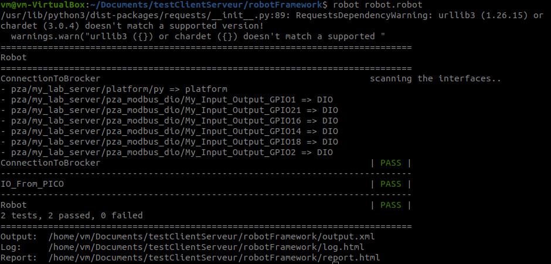


<!-- 


# ---------- old --------------------------- 

# MQTT configuration

In this part, we will see the steps to install mosquitto MQTT broker.

For this project, the server configuration will be defined as : 

```bash
  BROKER_ADDR="localhost"
  BROKER_PORT=1883
  CHECK_USER_INPUT=True
  RUN_TEST=False
```
We will be connected in localhost and the port 1883 is the default port to use mqtt protocol.

## mosquitto installation

To use MQTT protocole, you will have to install the mosquitto server.

This installation will install the broker MQTT packages.

It is possible to use command lines to install the mosquitto server.

```bash
  sudo apt update # update the environment
  sudo apt install -y mosquitto # install the mosquitto package
```

To make sure mosquitto is installed, you run the command : 

```bash
  mosquitto --version
```
you should have the following output in the terminal


Then ensure, that the mosquitto package is loaded by using the following command. 

```bash
  sudo systemctl status mosquitto
```


## installation of MQTT explorer

`TODO: Oui mais il faut montrer comment ça marche et comment on voit que ça fonctionne (mets le à la fin du tuto en bonus)`

MQTT explorer is a practical graphical tool used to testing communication via MQTT broker. With this tool, you can test the different data you have send threw your topics.

To install MQTT broker, you need to use the following commands :

```bash
  sudo snap install mqtt-explorer # installation of MQTT explorer
```

To launch MQTT, you can either search the application in the ubuntu envirronment or use the following command line :

```bash
  mqtt-explorer
```

# PANDUZA CLIENT

`TODO: Oui mais il faut montrer comment ça marche et non pas comment il est construit`

The panduza client will be the interface between the user and the panduza ecosystem.
The role of the client will be to configure various parameters to send the data of the i/o's to the correct destination.

A digital input output is has various attributs and and fields attached to the those attributs.

```python
  # === DIRECTION ===
  self.add_attribute(
     Attribute( name = "direction" )
  ).add_field(
     RwField( name = "value" )
  ).add_field(
     RwField( name = "pull" )
  ).add_field(
    RwField( name = "polling_cycle" )
  )

  # === STATE ===
  self.add_attribute(
    Attribute( name = "state" )
  ).add_field(
    RwField( name = "active" )
  ).add_field(
    RwField( name = "active_low" )
  ).add_field(
    RwField( name = "polling_cycle" )
  )
```


digital input output has two attributs : direction and state. in each attribut we can add fields that will define the direction and the state of the current I/O.

Those parameters will help us to code the driver functions to get and update the fields.

There is a functionnal python script used to send data to the  gpio 16 of pico via the MQTT broker.
We will set data to each fields by using the get() method.


```python
  from panduza import Client, Dio
  import time, logging


  # CONFIGURATION
  BROKER_ADDR="localhost"
  BROKER_PORT=1883
  CHECK_USER_INPUT=True
  RUN_TEST=False

  # one topic per io
  TOPIC16="pza/my_lab_server/pza_modbus_dio/My_Input_Output_GPIO16"


  testClient = Client(url=BROKER_ADDR, port=1883)
  testClient.connect()

  # scan the interface
  inter = testClient.scan_interfaces()

  # list all the topics
  print("scanning the interfaces..")
  for topic in inter:
      print(f"- {topic} => {inter[topic]['type']}")

    # declare instances of dio. One per io control
    d16 = Dio(addr=BROKER_ADDR, port=BROKER_PORT, topic=TOPIC16, client=testClient)

    print("setting the values for GPIO 16")
    d16.direction.value.set("toggle_led_16", ensure = False)
    time.sleep(1)
    d16.direction.pull.set("open", ensure = False)
    time.sleep(1)
    d16.direction.polling_cycle.set(10, ensure = False)
    time.sleep(1)

    d16.state.active.set(False, ensure = False)
    time.sleep(1)
    d16.state.active_low.set(True, ensure = False)
    time.sleep(1)
    d16.state.polling_cycle.set(100, ensure = False)
    time.sleep(1)

```
This script allows us to control io 16 of the PICO.

There are various steps to configure the client.
First we configure the parameters of the MQTT broker. the address will be "localhost and the listening port is 1883.

Then we declare topics. A topic is a path where the data will be send to the MQTT broker. 
In this example, we will send data to four I/O. It means that we have to create one topic per I/O/


# PANDUZA PLATFORM

`TODO: la platform il faut en parler plus tot et expliquer comment l'utiliser depuis docker, ici c'est trop complexe pour un utilisateur de partir du clone`


The panduza platform is the motor of the panduza eco-system.

It will be the interface where we will develop the drivers and various functions to send data directly to the PICO.

## Architecture of panduza platform

You will have to clone the following repository  and checkout the branch diob: 

```bash
  git clone git@github.com:Panduza/panduza-py.git
  git checkout dio
```


The meta drivers will declare the set and get functions for each io attributs. The platform will then call those functions, do a first update of the MQTT brocker. Then according to the message of the client, it will call the connector functions to write data to the PICO.

To run the panduza platform you will need to have configuration files : 

one docker-compose.yml
one tree.json

A docker-compose.yml file is a configuration file used by Docker compose. It will run container docker applications.

```yml
version: '3'
services:
  # docker compose run --service-ports mosquitto
  mosquitto:
    image: eclipse-mosquitto
    ports:
      - 1883:1883
      - 9001:9001
    volumes:
      - ./data/mosquitto.conf:/mosquitto/config/mosquitto.conf
  panduza-py-platform:
    # image: ghcr.io/panduza/panduza-py-platform:latest
    # To use your local platform build
    image: local/panduza-py-platform
    privileged: true
    depends_on: 
      - mosquitto
    network_mode: host
    volumes:
      - .:/etc/panduza
      - /run/udev:/run/udev:ro
    # command: bash
```
The most important parameter it image. In this case we will use the local image.

A tree.json file is a specific file in the panduza eco-system. This is used to configure the interfaces to be managed and the associated brokers.
```json
{
    "machine": "my_lab_server",
    "brokers": {
        "I/O driver": {
            "addr": "localhost",
            "port": 1883,
            "interfaces": [
                {
                    "name": "My_Input_Output_GPIO%r",
                    "driver": "pza_modbus_dio",
                    "repeated": [1,2,16,18]
                }
            ]
        }
    }
}
```
For this purpose, we will use the pza_modbus_dio driver witch was declared in the panduza platform driver. 
Also, since a driver is used to control a single IO. The field "repeated" will manage us to declare various instances of a same driver. This tree.json will control GPIO 1, 2, 16 and 18.


# PICO CONFIGURATION

The first step will be the configuration of the PICO so that it can receive data in modbus protocol

The firmware uses a library call liblightmodbus.

Ligthmodbus is a way to integrate modbus fonctionnalities in a embedded platform. The powerfull library allow's us to
configure platforms as master or slaves. In our example, the pico will be the slave.
But the most important is that the library is able to reconize and parse modbus RTU frame. Thanks to that, the firmware will no longer
have to check what type of frame is received.

A first version of the firmware has already been developped by our panduza developpers team.

in a directory clone the following repository :

```bash
  git clone git@github.com:Panduza/panduza-adapters-sdk.git # ssh key needed
```
The repository has various branches.
You need to checkout the following branch :

```bash
  git checkout 2-issue-sur-les-déclarations-des-interfaces-cdc
```

## how to build the project

in the root of the directory you will have to do to the following directory : 

```bash
  cd examples/pza-pico-modbus-dio
```

Once you are in this directory you can do the following steps to build the project

### Make sure cmake is installed ! 
```bash
  cmake --version
```

### How to build
```bash 
  mkdir build && cd build && cmake .. && make # this may take some time.
```
the following command will generate binary files.
In order to program the PICO, you will have to drop the .uf2 file to the pico.

In order to do this, you need to check the following requirements : 
the PICO is in boot mode.

to make sure type lsusb command in linux terminal and you should see the following line : 

```bash
  Bus 001 Device 018: ID 2e8a:0003 Raspberry Pi RP2 Boot
```

The PICO is now ready to get data from panduza platform.


# RUN PROJECT

Now that the pico is programmed and able to receive data threw modbus. 
We can now run the panduza platform and client.

To run the ecosystem you first need to program the PICO. Then you have to run the platform and excecute the client.

## RUN panduza platform

to run the panduza platform, you first need to build the docker image.

in the panduza-py repository. Go to the platform directory and build the image

```bash
  cd panduza-py/platform # move to platform dir
  ./docker.build-local.sh # build the image
```

The first build may take some time.
Note, the following command can be used if you with rebuild completely the image : 

```bash
  docker build --no-cache --tag local/panduza-py-platform:latest .
```
Once the image is build. You can run the platform.
For this, go to the /deploy/etc_deploy directory

```bash
  cd deploy/etc_panduza
```

then excecute the following command to run the panduza platform

```bash
  docker compose up
```

You must have the following result : 


The docker compose will do a first init of the MQTT broker. This initiation was defined in the driver function.


Make sure you the topics are visible with the rigth data.


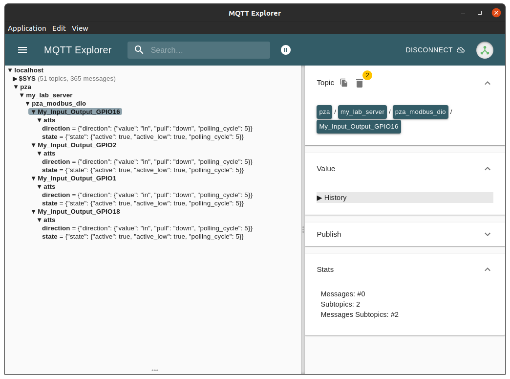


## RUN panduza client

To run the client, you need to run a client script.
This script can be modify and adaptable for your own purpose.
But it must follow the following architecture.

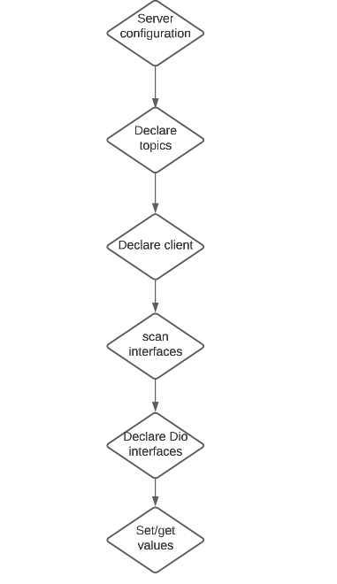


Note that one declaration of a topic and Dio interface is used to control a single IO. 
Therefore, if you wish control multiple digital inputs outputs, you will jave to declare various topics and Dio interfaces

The topics declared must match with the topics visible in the mqtt explorer.

A script example is available in the client configuration and explication.
 -->
